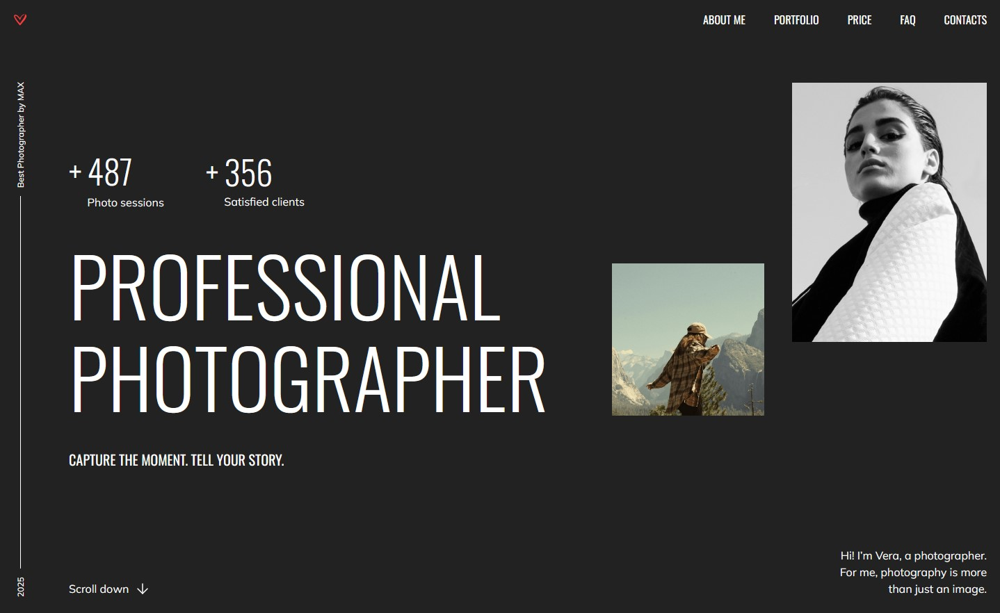
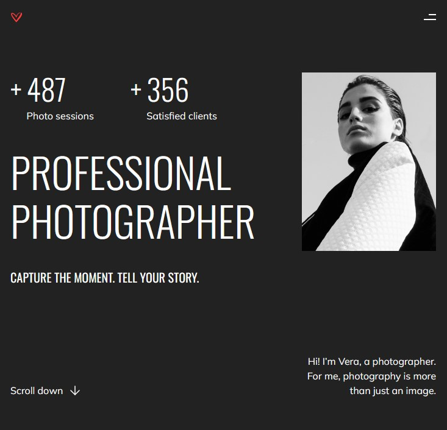
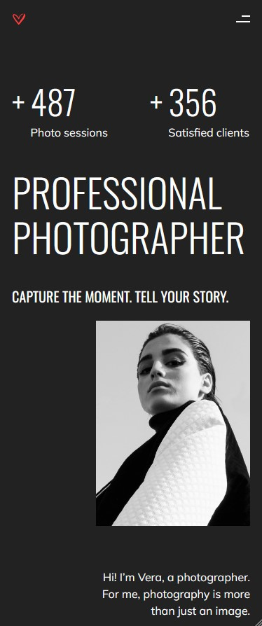

**Прочитать на:** [English](README_en.md) | [Русский](README.md)

## Портфолио фотографа
Это моя домашняя работа для [RS School](https://rs.school/), JS / Front-end Course 2025 Q3

1. **Задание**: [текст](https://github.com/rolling-scopes-school/tasks/blob/master/stage1/tasks/portfolio/portfolio-part-1.md) + [дизайн](https://www.figma.com/design/iFsApEUsf6tPwXas56gOiT/Portfolio?node-id=26-1637&t=L9uya9x6r8IlKFzP-0)
2. **Деплой** (можно посмотреть как работает сайт): [ссылка](https://rolling-scopes-school.github.io/thefoxtale-JSFE2025Q3/portfolio/)

Дополнительные криншоты

### Описание задачи:

Часть 1: Адаптивная верстка

1. Верстка разделов страницы соответствует дизайну при ширине экрана 1440px и выше: <b>+40</b>
    - [x] заголовок: <b>+4</b>
    - [x] раздел Hero: <b>+4</b>
    - [x] раздел About: <b>+4</b>
    - [x] раздел Portfolio: <b>+4</b>
    - [x] раздел Price: <b>+4</b>
    - [x] раздел FAQ: <b>+4</b>
    - [x] подвал: <b>+4</b>
    - [x] При масштабировании страницы браузера (<100%) или увеличении ширины страницы (>1440px) верстка страницы (кроме содержимого слайдера) центрируется, а не смещается в сторону и не растягивается на всю ширину: <b>+6</b>
    - [x] Фоновый цвет разделов растягивается на всю ширину экрана: <b>+6</b>

2. Верстка разделов страницы соответствует дизайну при ширине экрана 768px: <b>+28</b>
    - [x] заголовок: <b>+4</b>
    - [x] раздел Hero: <b>+4</b>
    - [x] раздел About: <b>+4</b>
    - [x] раздел Portfolio: <b>+4</b>
    - [x] раздел Price: <b>+4</b>
    - [x] раздел FAQ: <b>+4</b>
    - [x] подвал: <b>+4</b>

3. Верстка разделов страницы соответствует дизайну при ширине экрана 380px: <b>+28</b>
    - [x] заголовок: <b>+4</b>
    - [x] раздел Hero: <b>+4</b>
    - [x] раздел About: <b>+4</b>
    - [x] раздел Portfolio: <b>+4</b>
    - [x] раздел Price: <b>+4</b>
    - [x] раздел FAQ: <b>+4</b>
    - [x] подвал: <b>+4</b>

4. При любой ширине между 1440px и 380px не появляется горизонтальная полоса прокрутки. Весь контент страницы отображается точно так, как задумано в дизайне — ничего не обрезается, не удаляется и не смещается: <b>+12</b>
    - [x] нет горизонтальной полосы прокрутки при изменении ширины экрана от 1440px до 768px: <b>+6</b>
    - [x] нет горизонтальной полосы прокрутки при изменении ширины экрана от 768px до 380px: <b>+6</b>

5. При плавном изменении размера окна браузера от 1440px до 380px верстка занимает всю ширину окна (включая указанные отступы), элементы корректно изменяют свои размеры и позиции без полного масштабирования, ни один элемент не накладывается на другой, изображения сохраняют правильные пропорции:
    - [x] <b>+8</b>

6. При ширине экрана 768px меню и навигационные ссылки в заголовке скрываются, и отображается иконка бургер-меню:
    - [x] <b>+4</b> (Примечание: Активация иконки бургер-меню на этом этапе не оценивается.)

7. Интерактивность: <b>+26</b>
    - [x] Плавная прокрутка с помощью якорных ссылок: <b>+4</b>
    - [x] Интерактивность ссылок и кнопок реализована в соответствии с макетом Figma. Интерактивность включает не только изменение внешнего вида курсора (например, с помощью свойства cursor: pointer), но и использование других визуальных эффектов (таких как изменение цвета фона или цвета шрифта), в соответствии с Styleguide в макете Figma. Если интерактивность не указана в Styleguide, достаточно свойства cursor: pointer: <b>+4</b>
    - [x] Каждая Package-card в разделе Packages & Pricing интерактивна (цвет границы и кнопки) при наведении на любую область карточки: <b>+6</b>
    - [x] Каждый заголовок аккордеона в разделе FAQ интерактивен (цвет названия и знака "плюс") при наведении на любую область заголовка, кроме содержимого этого аккордеона: <b>+6</b> (Примечание: Открытие/закрытие разделов аккордеона на этом этапе не оценивается.)
    - [x] Обязательное требование для интерактивности: плавное изменение внешнего вида элемента при наведении, без влияния на соседние элементы: <b>+2</b>
    - [x] Эффекты наведения активны на настольных устройствах (согласно типу устройства Desktop в DevTools) и отключены для мобильных устройств (согласно типу устройства Mobile в DevTools): <b>+4</b>

8. Проверка валидности страницы: <b>+14</b>
    - [x] Верстка страницы проверена и не содержит ошибок согласно W3C Validator (https://validator.w3.org/): <b>+6</b>
        - Валидная разметка проверенной страницы соответствует сообщению "Document checking completed. No errors or warnings to show." В этом случае выставляется полное количество баллов за проверенную страницу (+6).
        - Если есть предупреждения, но нет ошибок, выставляется половина баллов (+3) за проверенную страницу
    - [x] На страницу добавлена Favicon: <b>+4</b>
    - [x] Только один h1 на странице: <b>+4</b>

Часть 2: Добавление функциональности

1. Реализация бургер-меню: +40
    - [x] При 768px и ниже навигационная панель скрывается, и появляется иконка меню (так называемое "бургер-меню"): +4
    - [x] Иконка меню создана с помощью HTML и CSS без использования изображений/svg: +4
    - [x] При клике на иконку меню справа выезжает блок меню, а иконка меню плавно превращается в крестик: +4
    - [x] Блок меню занимает всю доступную область экрана ниже блока <header>: +4
    - [x] Размещение и размеры элементов в блоке меню соответствуют макету (горизонтальное и вертикальное центрирование пунктов меню): +4
    - [x] При клике на крестик блок меню плавно скрывается, уезжая вправо за пределы экрана, а крестик плавно превращается в иконку меню (параллельные линии): +4
    - [x] При клике на любую ссылку в меню блок меню плавно скрывается вправо, а крестик плавно превращается в иконку меню (параллельные линии): +4
    - [x] Ссылки плавно прокручивают к своим якорным точкам: +4
    - [x] Страница за открытым меню не прокручивается. После закрытия меню прокрутка снова работает: +4
    - [x] Выше 768px и иконка меню, и меню скрываются, и отображается стандартная навигационная панель: +4

2. Реализация слайдера: +40
    - [x] По умолчанию дорожка слайдера должна быть горизонтально отцентрирована на странице: +4
    - [x] На десктопе прокрутка слайдера активируется автоматически при наведении курсора на левую или правую область: +8
    - [x] На десктопе активная область для прокрутки слайдера составляет ~30% ширины экрана с каждой стороны: +8
    - [x] На десктопе оставшаяся область в центре неактивна: +4
    - [x] На мобильных устройствах слайдер прокручивается свайпом пальца: +8
    - [x] Конечные позиции слайдера выровнены с контентом страницы с обеих сторон. Прокрутка заблокирована за этими точками: +8

3. Реализация аккордеонов в разделе FAQ: +24
    - [x] По умолчанию первый блок аккордеона открыт: +4
    - [x] Можно открыть или закрыть аккордеон, кликнув в любом месте его заголовка: +4
    - [x] Только один аккордеон может быть открыт одновременно (открытие нового закрывает предыдущий): +8
    - [x] Состояние аккордеона сохраняется после перезагрузки страницы (открывается последний активный блок): +8

4. Реализация модальных окон: +22
    - [x] Модальное окно открывается при клике на любую кнопку "BOOK NOW" в карточках раздела Packages & Pricing: +6
    - [x] Часть страницы за пределами модального окна затемнена: +4
    - [x] При открытом модальном окне вертикальная прокрутка страницы становится неактивной; при закрытии снова становится активной: +4
    - [x] Клик как вне модального окна, так и на кнопку закрытия закрывает его: +4
    - [x] Модальное окно отцентрировано по обеим осям, размеры элементов модального окна и их верстка соответствуют дизайну: +4

5. Реализация кнопки прокрутки вниз: +4
    - [x] При клике на кнопку страница прокручивается к разделу About: +4

